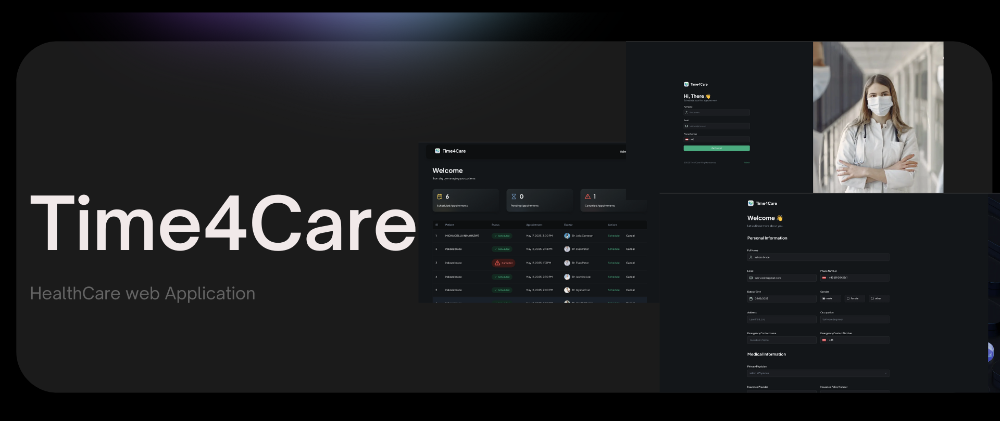

<p align="center">
  
  
  
    
  
</p>

<pre align="center"> <span style="background-color:#1E3A8A;color:white;padding:10px 20px;border-radius:5px;font-size:54px;">HealthCare Management System</span> </pre>

## Project Description

`HealthCare Management System` is a digital platform designed to streamline operations in healthcare facilities. It allows patients to easily register, book, and manage appointments with doctors. Built with Next.js, the system includes administrative tools for scheduling, confirming, and canceling appointments, along with integrated SMS notifications to keep patients informed.

## Features 🔋

👉 Register as a Patient: Users can sign up and create a personal profile as a patient.

👉 Book a New Appointment with Doctor: Patients can schedule appointments with doctors at their convenience and can book multiple appointments.

👉 Manage Appointments on Admin Side: Administrators can efficiently view and handle all scheduled appointments.

👉 Confirm/Schedule Appointment from Admin Side: Admins can confirm and set appointment times to ensure they are properly scheduled.

👉 Cancel Appointment from Admin Side: Administrators have the ability to cancel any appointment as needed.

👉 Send SMS on Appointment Confirmation: Patients receive SMS notifications to confirm their appointment details.

👉 Complete Responsiveness: The application works seamlessly on all device types and screen sizes.

👉 File Upload Using Appwrite Storage: Users can upload and store files securely within the app using Appwrite storage services.

👉 Manage and Track Application Performance Using Sentry: The application uses Sentry to monitor and track its performance and detect any errors.

## Tech Stack ⚙️

- Next.js
- Appwrite
- Typescript
- TailwindCSS
- ShadCN
- Twilio

## Getting Started 🤸

#### Clone the repository

```bash
git clone https://github.com/irabruce10/time4care.git
cd time4care
```

#### Installation

Install the project dependencies using npm:

```bash
npm install
# and
npm run dev
```

Open [http://localhost:3000](http://localhost:3000) with your browser to see the result.

This project uses [`next/font`](https://nextjs.org/docs/app/building-your-application/optimizing/fonts) to automatically optimize and load [Geist](https://vercel.com/font), a new font family for Vercel.

## Learn More

To learn more about Next.js, take a look at the following resources:

- [Next.js Documentation](https://nextjs.org/docs) - learn about Next.js features and API.
- [Learn Next.js](https://nextjs.org/learn) - an interactive Next.js tutorial.

You can check out [the Next.js GitHub repository](https://github.com/vercel/next.js) - your feedback and contributions are welcome!

## Deploy on Vercel

The easiest way to deploy your Next.js app is to use the [Vercel Platform](https://vercel.com/new?utm_medium=default-template&filter=next.js&utm_source=create-next-app&utm_campaign=create-next-app-readme) from the creators of Next.js.

Check out our [Next.js deployment documentation](https://nextjs.org/docs/app/building-your-application/deploying) for more details.
